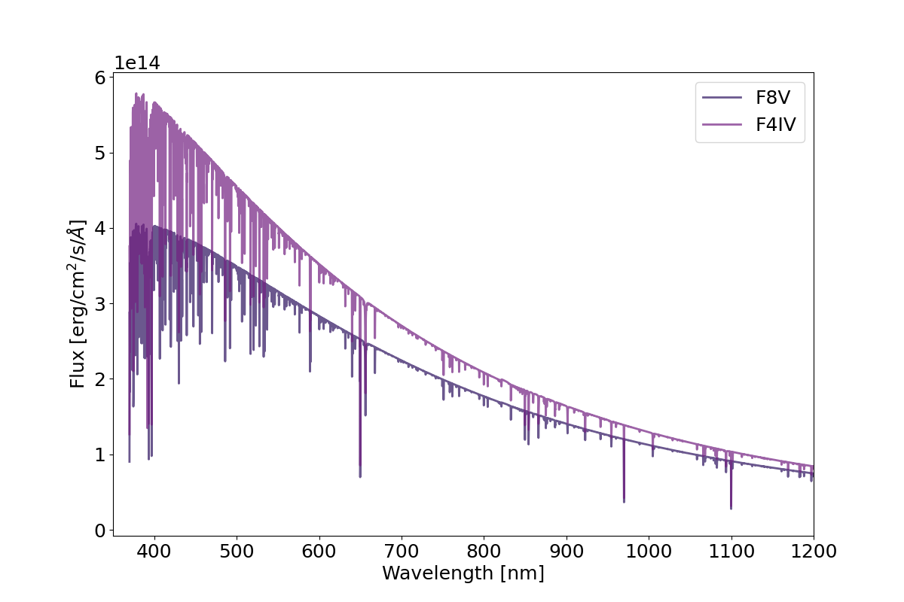
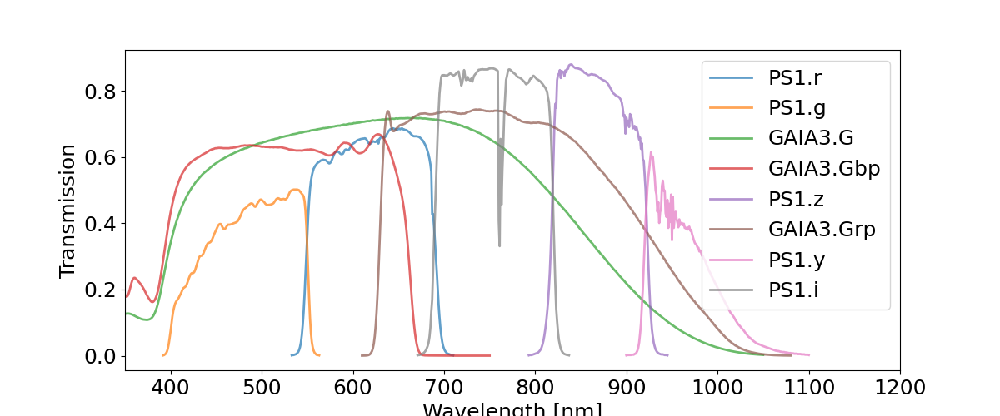
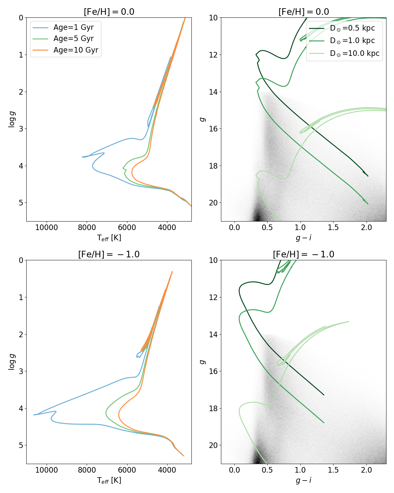
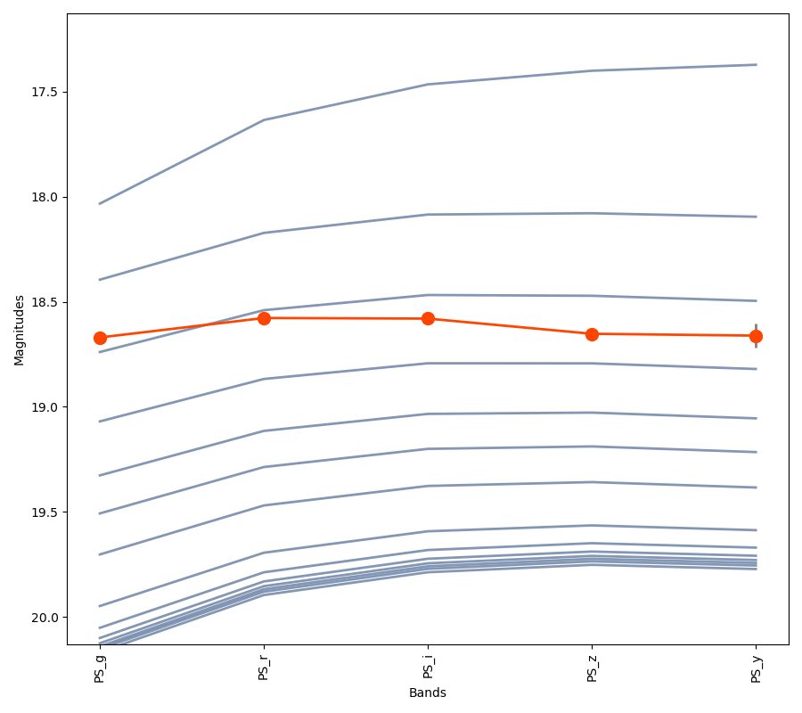
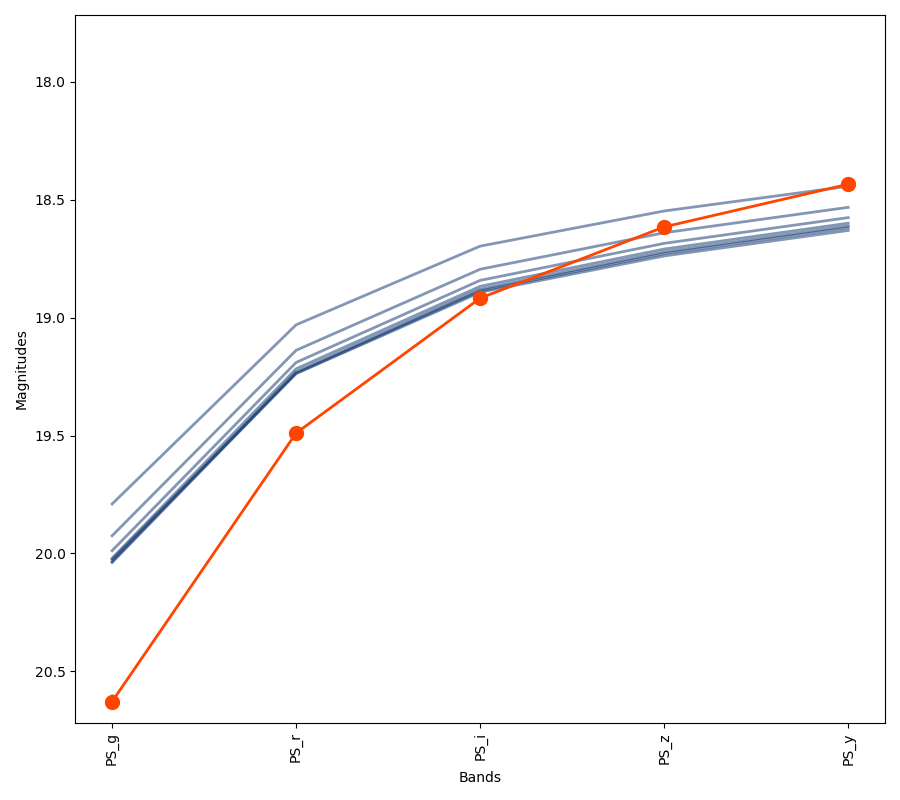
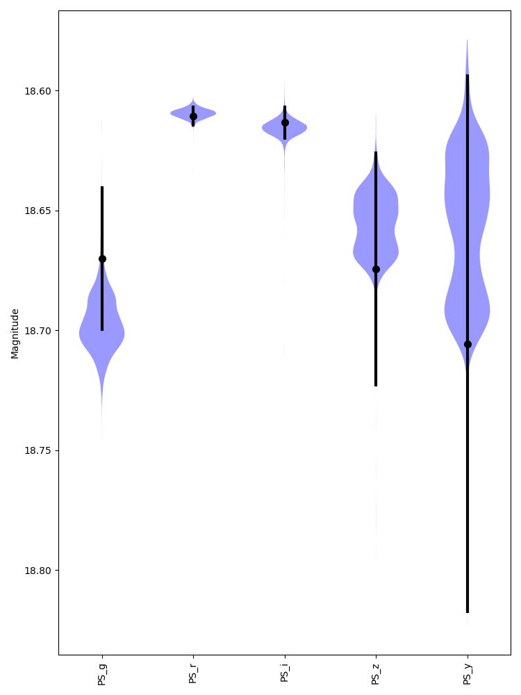
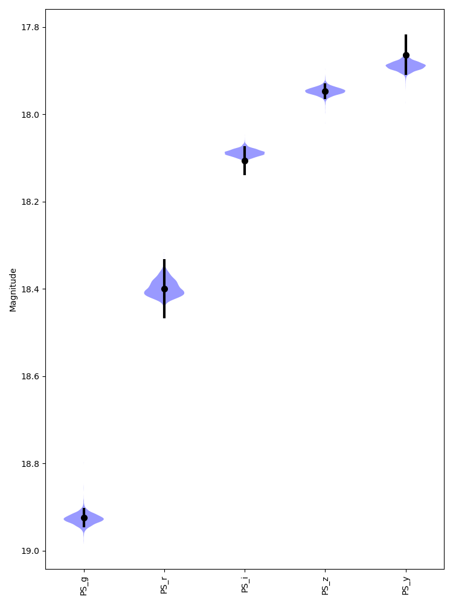
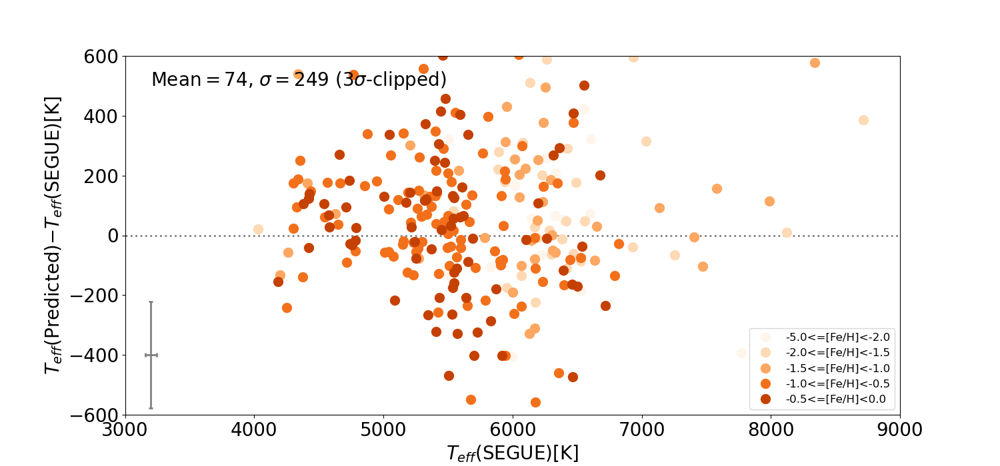
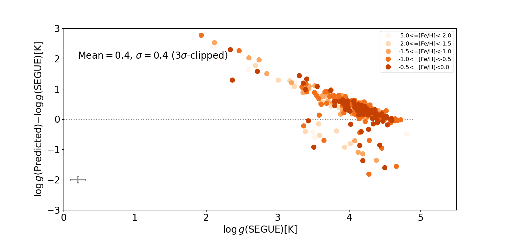
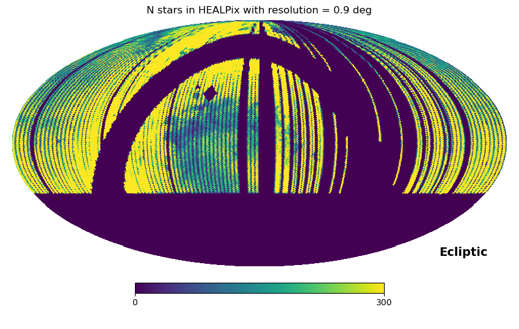

The catalog of flux standard stars for PFS
==================================================


Catalog description
---------------------------------------------------

The catalog of flux standard stars for PFS contains stellar temperature estimates 
for 0.2 billion stars selected from the cross-matched catalog of PanSTARRS1 DR2 and Gaia DR3. 
The probability of being an F-type star is calculated primarily based on 
PanSTARRS1 griz photometry to cover most of the stars down to g~20. 


Flux standard stars for PFS
--------------------------------------------------
The photometric selection is made to satisfy following requirements.
* Stars should have photometric estimates of effective temperatures and surface gravity compatible with 
F-type main sequence stars. F-type stars are an ideal flux standards because the continuum level is 
less affected by absorption lines than other spectral types. 
* The stars should be brighter than g~20 so that a sufficient signal-to-noise is reached within a single exposure (15 miniutes) 
taken with the low-resolution mode.  
* The stars should be sufficiently numerous and homogeneously distributed on the sky 
to evaluate the throughput variation accros the PFS field-of-view. 





Photometric data
--------------------------------------------------
The selection of F-type stars are made by using PanSTARRS1 griz-band photometry (See the figure below for the transmission curves of broad-band filters used in PanSTARRS1 and Gaia). The y-band photometry is 
shallower than others and thus will not be used. Those four bands cover a wavelength range from 400-900nm. An additional use of Gaia would not improve the parameter estimates significantly (to be tested by SEGUE).  





Base catalogs
---------------

1. Gaia DR3

The entire catalog has been downloaded from Gaia archive website and installed to a local database.


2. PanSTARRS1 DR2 

Downloaded through MAST casjobs query for a slice of one degree in right accention (ra = 359-360 in the following example). 


```
select m.objID, objName, raMean as RAJ2000, decMean as DEJ2000, l, b, gMeanPSFMag as gmag, gMeanPSFMagErr as e_gmag, gFlags, rMeanPSFMag as rmag, rMeanPSFMagErr as e_rmag, rFlags, iMeanPSFMag as imag, iMeanPSFMagErr as e_imag, iFlags, zMeanPSFMag as zmag, zMeanPSFMagErr as e_zmag, zFlags, yMeanPSFMag as ymag, yMeanPSFMagErr as e_ymag, yFlags, ng, nr, ni, nz, ny, objInfoFlag, qualityFlag, psc.ps_score into mydb.RA359_360_gmag135_210 from MeanObjectView m join HLSP_PS1_PSC.pointsource_scores psc on psc.objid=m.objID where raMean between 359 and 360 and (b<-10 or b>10) and gMeanPSFMag<21. and gMeanPSFMag>13.5 and ng>0 and nr>0 and ni>0 and nz>0
```


Note that the median 50% completeness of PFS photometry are  g=23.2, r=23.2, i=23.1, z=22.3 and y=21.2 with significant variation accross the sky.
 See [PS1 website](https://outerspace.stsci.edu/display/PANSTARRS/PS1+Photometric+Depth). 


3. Gaia x PanSTARRS1 cross match

Cross-matched table (list of Gaia ID and corresponding PanSTARRS1 ID) from Gaia archive


4. Create a combined catalog


```
   count
-----------
 201818351
(1 row)
```


Quality cuts
-------------------------------------

Inorder to ensure the quality of the photometric data, we adopt the following quality cuts. 

- $g>14$ to avoid saturated objects.
- Non-negative values of uncertainties in PS1 magnitudes.  
- ${\rm ps\_score} > 0.8$ : To ensure an object is a point source according to the classification scheme of [Tachibana+18](https://iopscience.iop.org/article/10.1088/1538-3873/aae3d9). 
 


```
   count   
-----------
 185990390
(1 row)

```
(92% of the original cross-matched catalog.)


Summary of the selection methods
-------------------------------------


1. Logistic regression (Version 1.X, 2.X) 

* Training sample: Stars with spectroscopic $T\_{eff}$ and $\log g$ estimates from SEGUE catalog. 
  F-type stars are defined as stars that satisfy $6000 < T\_{eff} < 7800$ [K] and $3.5<\log g<5.5$. 
* Input: $g$, $r$, $i$, $z$, extinction map
* Output: Probability of being an F-type star 


2. Stellar parameter estimates based on the [brutus](https://github.com/joshspeagle/brutus) code (Version 3.X)

 
* Input: $g$, $r$, $i$, $z$, parallax, stellar isochrone models
* Output: Posterior probability distribution of Teff and logg 


* The algorithm in brutus: 
  
  * Interporate a grid of bolometric correction for a given set of labels: 
      $T_{eff}$, $\log g$, [Fe/H], [$\alpha$/Fe], $A(V)$, $R(V)$ (see below for details).
  * The weights and bias for the interporation are pre-computed. The interporation 
     is therefore very fast 

 

3. Stellar parameter estimates based on a full MCMC

    Input: $g$, $r$, $i$, $z$, parallax, extinction map, stellar isochrone models
    Output: Posterior probability distribution of $T\_{eff}$ and $\log g$.


Stellar parameter estimates based on the brutus code
--------------------------------------------------


### The algorithm


See [brutus Github website](https://github.com/joshspeagle/brutus) for more details.

(See also StarHorse algorithm: arXiv:2111.01860v2)


 * For the models of stellar structure and evolution, we make use of [MIST stellar isochrone models](https://waps.cfa.harvard.edu/MIST/).
      The isochrones are prepared by varying the following parameters:
   * metallicity ([Fe/H])
   * age (log t\_age[yrs])
   * extinction A(V)[mag]
   * differential extinction (R(V))
   * secondary mass fraction (q)
   * distance (d [kpc]). 
     
	In the following we assume observed stars are single and thus q=0.
  
 *    In each isochrone, stellar parameters (e.g., $T\_{eff}$, $\log g$, etc.) are given over a grid of 
      equivalent evolutionary points (EEPs). 

 *    The spectral energy distribution of a given set of stellar model parameters can be computed thanks to the 
      neural network model implemented in the code.
 
 * 　 We first prepare tables of the stellar isochrone models and SED models of a desired filter set (PS1 $griz$).  
 
 *    Given observed fluxs of the filters, posterior probabilities of stellar parameters are computed. 


### Isochrone models and predictued spectral energy distribution

The left panels of the figure below show MIST issochrone models with [Fe/H]$=0.0$ (top) and 
[Fe/H]$=-1.0$ (bottom) on $T\_{eff}$-$\log g$ diagrams. 
Different colors of the lines represent the ages (1, 5, and 10 Gyrs) 
of the isochrones. 

The right panels show predicted $g-i$ colors versus apparent $g$-band magnitudes 
of the model with [Fe/H]$=0.0$ (top) and
[Fe/H]$=-1.0$ (bottom). Different colors of the lines represent adopted heliocentric 
distances (0.5, 1.0, and 10kpc). It can be seen that our selection of $g<20$ F-type 
stars would contain main-sequence stars up to $\sim 10$ kpc. The F-stars are bluer for 
the metal-poor ([Fe/H]$=-1.0$) stars. 

   





Gray lines in the figures below show the predicted SEDs of F-dwarf 
(top: [Fe/H]$=-1$, $M\_{ini}=0.8M\_\odot$, and $D=8$[kpc]) 
and M-dwarf (bottom: [Fe/H]$=-1.5$, $M\_{ini}=0.5$, and $D=2$[kpc]) 
at various evolutionary phases. Red points and lines 
show an observed SED of each spectral type. 







### Validation with SEGUE sample

We use a subset of SDSS/SEGUE catalog with known stellar parameters (e.g., $T\_{eff}$, $\log g$) from 
spectroscopy and PanSTARRS1 photometry to validate the SED fitting method. 
Figures below show the results of the fitting to observed SEDs (black points with error bars) with 
model SEDs (purple area) for 
(a) F-type star at high Galactic latitude (b=62), 
(b) F-type star at low Galactic latitude (b=14), 
(c) M-type star at high Galactic latitude (b=57). 
Stellar parameters, $T\_{eff}$ [K] and $\log g$ [dex], from SEGUE spectroscopy 
and from PS1 photometry with brutus are shown at the top of each panel.


The comparison between (a) and (b) illustrates 
that the galactic extinction makes the observed SEDs 
very different from the intrinsic SEDs. 
Since the brutus code takes into account the 3D Galactic extinction map 
and Galactic stellar distributions as priors, it correctly reproduces the spectroscopic (SEGUE) parameters.


(a) SEGUE: $7137\pm 82$, $4.19\pm 0.12$, PS1 + brutus: $7264^{+366}\_{-244}$, $4.3^{+0.2}\_{-1.4}$


(b) SEGUE: $6907\pm 75$, $4.07\pm 0.20$, PS1 + brutus: $6202^{+418}\_{-343}$, $4.5^{+0.1}\_{-0.2}$


(c) SEGUE: $4029\pm 22$, $4.25\pm 0.05$, PS1 + brutus: $4021^{+140}\_{-136}$, $4.7^{+0.1}\_{-0.1}$


Figures below show the difference between predicted and spectroscopic 
stellar parameters (Top: $T\_{eff}$, Bottom: $\log g$). 
A significant deviation can be seen at low $\log g$ side 
where the algorithm over-predict the true $\log g$. 
The scatters are similar for various [Fe/H] ranges.







### Sky distribution 





### Number density 

### Magnitude distribution 


## Preparation of specific run


Reference
------------------------------

https://docs.github.com/ja/get-started/writing-on-github/getting-started-with-writing-and-formatting-on-github/basic-writing-and-formatting-syntax


