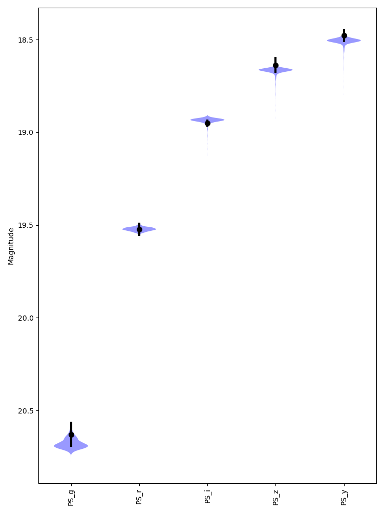
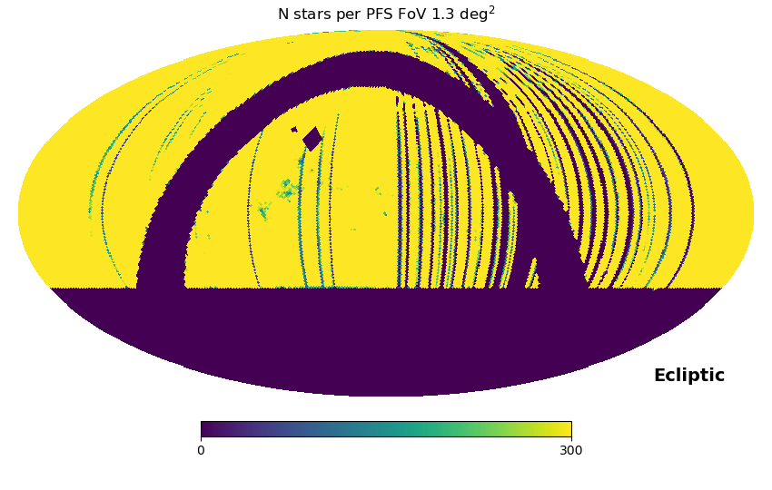
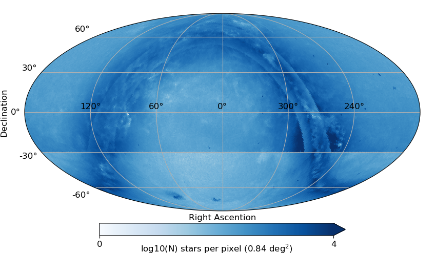
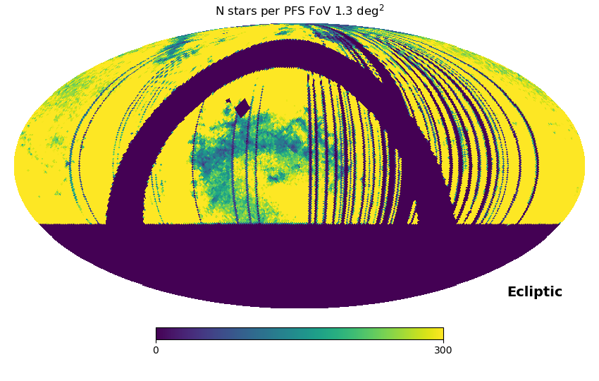

The catalog of flux standard stars for PFS
==================================================


Versions
--------------------------------------------------

* 2.0: used in - Jul. 2023 comissionning runs  

	* The F-star candidates are selected from a crossmatch of PanStarrs1(PS1) DR2 and Gaia DR3.
	* The SDSS/SEGUE catalog is used to train the Logistic Regression model to identify likely F-type stars based on the extinction-corrected PS1 $g-r$ and $i-z$ colors.  
	* The trained model is then applied to calculate the probability of being an F-type star for each star in the crossmatched catalog.


* 3.2: partly used in Jul. 2023 commissionong run (see below for details)

	* The F-star candidates are selected from a crossmatch of PanStarrs1(PS1) DR2 and Gaia DR3.
	* The observed PS1 $griz$ fluxes are fitted by the SED models implemented in the brutus code.
	* The probability of being an F-type star is calculated from the posterior probability distrion of effective temperature for each star.


Catalog description
---------------------------------------------------

The catalog of flux standard stars for PFS contains the estimates of effective temperature 
for $\sim 10^8$ stars selected from a cross-matched catalog of PanSTARRS1 DR2 and Gaia DR3. 


The probability of being an F-type star is calculated primarily based on 
PanSTARRS1 $grizy$ photometry for stars down to $g\sim 20$. 


Flux standard stars for PFS
--------------------------------------------------
The flux standard stars for PFS must meet the following requirements.

* The effective temperatures from photometry are compatible with an F-type star ($6000\lt T \lt 7500$ K). These stars 
serve as ideal flux standards because their continuum level is 
less affected by absorption lines compared to other spectral types. 
* The magnitudes should be brighter than $g\sim 20$ so that a sufficient signal-to-noise is reached within a single exposure (15 miniutes) 
under the low-resolution mode.  
* The stars should be sufficiently numerous and homogeneously distributed on the sky 
to evaluate the throughput variation accros the PFS field-of-view. 


Photometric data
--------------------------------------------------

The selection of F-type stars are made by using PanSTARRS1 $grizy$-bands and Gaia $G$, $G_{BP}$, $G_{RP}$-band photometry
(See the figure below for the transmission curves of broad-band filters 
used in PanSTARRS1 and Gaia). Those five bands cover the wavelength range of 400-900nm. 


Base catalogs
---------------

1. Gaia DR3

The entire catalog has been downloaded from [Gaia archive website](http://cdn.gea.esac.esa.int/Gaia/) and installed to a local database.


2. PanSTARRS1 DR2 

A subset of the MeanObject catalog has been downloaded through the [MAST casjobs](https://mastweb.stsci.edu/mcasjobs/) query 
for slices of one degree in right accention (ra = 359-360 in the following example). 


```
select m.objID, objName, raMean as RAJ2000, decMean as DEJ2000, l, b, gMeanPSFMag as gmag, gMeanPSFMagErr as e_gmag, gFlags, rMeanPSFMag as rmag, rMeanPSFMagErr as e_rmag, rFlags, iMeanPSFMag as imag, iMeanPSFMagErr as e_imag, iFlags, zMeanPSFMag as zmag, zMeanPSFMagErr as e_zmag, zFlags, yMeanPSFMag as ymag, yMeanPSFMagErr as e_ymag, yFlags, ng, nr, ni, nz, ny, objInfoFlag, qualityFlag, psc.ps_score into mydb.RA359_360_gmag135_210 from MeanObjectView m join HLSP_PS1_PSC.pointsource_scores psc on psc.objid=m.objID where raMean between 359 and 360 and (b<-10 or b>10) and gMeanPSFMag<21. and gMeanPSFMag>13.5 and ng>0 and nr>0 and ni>0 and nz>0
```


Note that the median 50% completeness of PFS photometry are  $g=23.2$, $r=23.2$, $i=23.1$, $z=22.3$ and $y=21.2$ with a significant variation accross the sky.
 See [PS1 website](https://outerspace.stsci.edu/display/PANSTARRS/PS1+Photometric+Depth). 


3. Extinction correction

The observed PanSTARRS1 magnitudes are corrected for Galactic extinction using the values of $E(B-V)$ from 
the recalibrated SFD map of [Schlafly & Finkbeiner 2011](https://ui.adsabs.harvard.edu/abs/2011ApJ...737..103S/abstract).
 
The conversion of $E(B-V)$ to the extinction of each pass band is made based on Table 6 of 
 [Schlafly & Finkbeiner 2011](https://ui.adsabs.harvard.edu/abs/2011ApJ...737..103S/abstract).


All Sky plot (TBD)


4. Gaia x PanSTARRS1 cross match (202080717 objects)

Cross-matched table (list of Gaia ID and corresponding PanSTARRS1 ID) from Gaia archive

All sky plot (TBD)


Quality and color cuts
-------------------------------------

We adopt the following cuts to ensure the quality of the photometric data and remove obvious contaminants. 
The numbers in perenthesis indicate the number of stars and its percentage after consecutively applying the cuts.

* Quality cuts
	* $14 < g < 21$ to avoid saturated or faint objects (201055911, 99.5%).  
	* Non-negative values of uncertainties in the PS1 magnitudes (198924399 98.4%).
	* `ps_score>0.8`, to ensure an object is a point source according to the classification scheme of [Tachibana et al. 2018](https://iopscience.iop.org/article/10.1088/1538-3873/aae3d9) (183661819, 90.9%).
	* `QF_OBJ_GOOD` flag value for the ObjectQualityFlags and `GOOD` flag value for the ObjectInfoFlags are both raised: [PS1 Object Flags](https://outerspace.stsci.edu/display/PANSTARRS/PS1+Object+Flags) (183661819, 90.9%).
	* `SECF_OBJ_EXT` flag values for all of the XFlags(X one of g, r, i, z, y) are NOT raised (171617590, 84.9%).
	* `number_of_neighbours=1` and `number_of_mates=0` in the `panstarrs1_best_neighbour` catalog: [Gaia DR3 documentation](https://gea.esac.esa.int/archive/documentation/GDR3/Gaia_archive/chap_datamodel/sec_dm_cross-matches/ssec_dm_panstarrs1_best_neighbour.html) (171355175, 84.8%). 

	 

* Color cut
	* The extention corrected color $g-i\lt 1.0$ to remove objects that are unlikely to be an F-type star (59465080, 29.4%)


Summary of the selection methods
-------------------------------------


1. Logistic regression (Version 1.X, 2.X) 

* Training sample: Stars with spectroscopic $T\_{eff}$ and $\log g$ estimates from SEGUE catalog. 
  F-type stars are defined as stars that satisfy $6000 \lt T\_{eff} \lt 7800$ [K] and $3.5<\log g<5.5$. 
* Input: $g$, $r$, $i$, $z$, extinction map
* Output: Probability of being an F-type star 


2. Stellar parameter estimates based on the [brutus](https://github.com/joshspeagle/brutus) code (Version 3.0 and later)

 
* Input: $g$, $r$, $i$, $z$, parallax, stellar isochrone models
* Output: Posterior probability distribution of Teff and logg 
* The algorithm in brutus: 
  
  * Interporate a grid of bolometric correction for a given set of labels: 
      $T_{eff}$, $\log g$, [Fe/H], [$\alpha$/Fe], $A(V)$, $R(V)$ (see below for details).
  * The weights and bias for the interporation are pre-computed. The interporation 
     is therefore very fast 

 

Stellar parameter estimates based on the brutus code
--------------------------------------------------


### The algorithm


See [brutus Github website](https://github.com/joshspeagle/brutus) for more details.

(See also StarHorse algorithm: arXiv:2111.01860v2)


 * For the models of stellar structure and evolution, we make use of [MIST stellar isochrone models](https://waps.cfa.harvard.edu/MIST/).
      The isochrones are prepared by varying the following parameters:
   * metallicity ([Fe/H])
   * age (log t\_age[yrs])
   * extinction A(V)[mag]
   * differential extinction (R(V))
   * secondary mass fraction (q)
   * distance (d [kpc]). 
     
	In the following we assume observed stars are single and thus q=0.
  

 *    In each isochrone, stellar parameters (e.g., $T\_{eff}$, $\log g$, etc.) are given over a grid of 
      equivalent evolutionary points (EEPs). 

 *    The spectral energy distribution of a given set of stellar model parameters can be computed thanks to the 
      neural network model implemented in the code.
 
 * 　 We first prepare tables of the stellar isochrone models and SED models of a desired filter set (PS1 $griz$).  
 
 *    Given observed fluxs of the filters, posterior probabilities of stellar parameters are computed. 


### Stellar evolution models and predictued spectral energy distribution


We make use the MIST stellar evolution model, which track the evolution of a particular 
star over its lifetime. The model includes calculated stellar parameters, such as luminosity or 
temperature, etc., at equivalent evolutionary points (EEP). Then, Brutus provides 
a set of neural network models to calculate the spectral energy distribution 
for a give set of predicted stellar parameters. The figure below 
show examples of predicted PS1 color-magnitude diagrams for a given stellar initial mass and metallicity ([Fe/H]).


To check how different stellar populations (e.g., stars born at the same time with the same initial composition) 
are distributed in the PS1 color-magnitude diagrams, the left panels of the figure below show MIST isochrone models with [Fe/H] $=0.0$ (top) and 
[Fe/H] $=-1.0$ (bottom) on $T\_{eff}$-$\log g$ diagrams. 
Different colors of the lines represent the ages (1, 5, and 10 Gyrs) 
of the isochrones. 

The right panels show predicted $g-i$ colors versus apparent $g$-band magnitudes 
of the model with [Fe/H] $=0.0$ (top) and
[Fe/H]$=-1.0$ (bottom). Different colors of the lines represent adopted heliocentric 
distances (0.5, 1.0, and 10kpc). It can be seen that our selection of $g<20$ F-type 
stars would contain main-sequence stars up to $\sim 10$ kpc. The F-stars are bluer for 
the metal-poor ([Fe/H] $=-1.0$) stars. 

   


### SEDs


Gray lines in the figures below show the predicted SEDs of F-dwarf 
(top: [Fe/H]$=-1$, $M\_{ini}=0.8M\_\odot$, and $D=8$[kpc]) 
and M-dwarf (bottom: [Fe/H]$=-1.5$, $M\_{ini}=0.5$, and $D=2$[kpc]) 
at various evolutionary phases. Red points and lines 
show an observed SED of each spectral type. 


### Validation with SEGUE sample

We use a subset of SDSS/SEGUE catalog with known stellar parameters (e.g., $T\_{eff}$, $\log g$) from 
spectroscopy and PanSTARRS1 photometry to validate the SED fitting method. 
Figures below show the results of the fitting to observed SEDs (black points with error bars) with 
model SEDs (purple area) for 
(a) F-type star at high Galactic latitude (b=62), 
(b) F-type star at low Galactic latitude (b=14), 
(c) M-type star at high Galactic latitude (b=57). 
Stellar parameters, $T\_{eff}$ [K] and $\log g$ [dex], from SEGUE spectroscopy 
and from PS1 photometry with brutus are shown at the top of each panel.


The comparison between (a) and (b) illustrates 
that the galactic extinction makes the observed SEDs 
very different from the intrinsic SEDs. 
Since the brutus code takes into account the 3D Galactic extinction map 
and Galactic stellar distributions as priors, it correctly reproduces the spectroscopic (SEGUE) parameters.


(a) SEGUE: $7137\pm 82$, $4.19\pm 0.12$, PS1 + brutus: $7264^{+366}\_{-244}$, $4.3^{+0.2}\_{-1.4}$


(b) SEGUE: $6907\pm 75$, $4.07\pm 0.20$, PS1 + brutus: $6202^{+418}\_{-343}$, $4.5^{+0.1}\_{-0.2}$


(c) SEGUE: $4029\pm 22$, $4.25\pm 0.05$, PS1 + brutus: $4021^{+140}\_{-136}$, $4.7^{+0.1}\_{-0.1}$



Figures below show the difference between predicted and spectroscopic 
stellar parameters (Top: $T\_{eff}$, Bottom: $\log g$). 
A significant deviation can be seen at low $\log g$ side 
where the algorithm over-predict the true $\log g$. 
The scatters are similar for various [Fe/H] ranges.


### The number density of stars selected by different Fstar probability thresholds

#### probfstar$>0.2$ 



#### probfstar$>0.5$



#### probfstar$>0.8$  



### Magnitude distribution 


## Preparation of specific run


Appendix
-----------------------------------

# The use of Gaia photometry


Reference
------------------------------

https://docs.github.com/ja/get-started/writing-on-github/getting-started-with-writing-and-formatting-on-github/basic-writing-and-formatting-syntax


